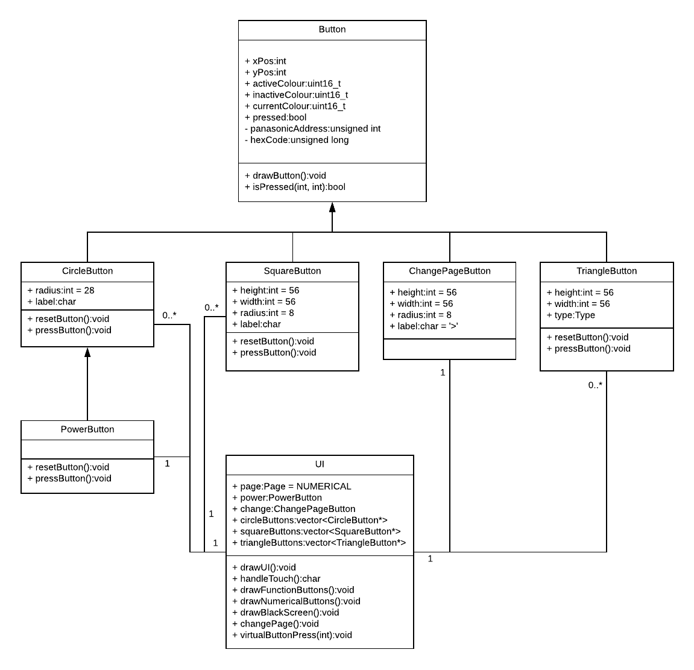
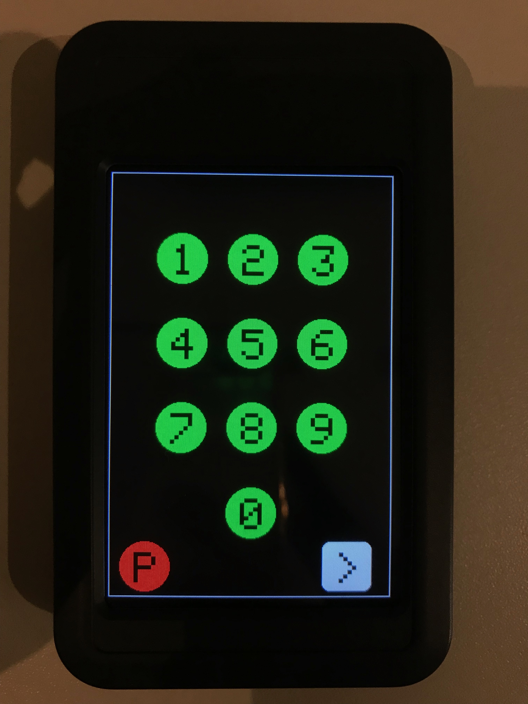
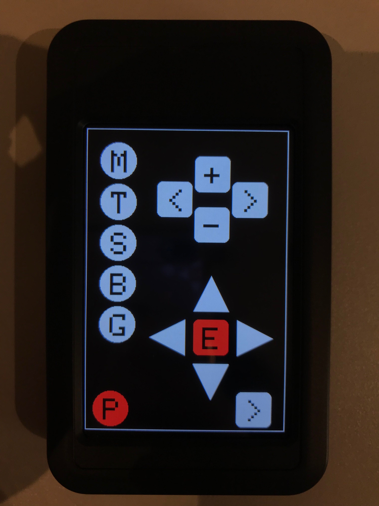
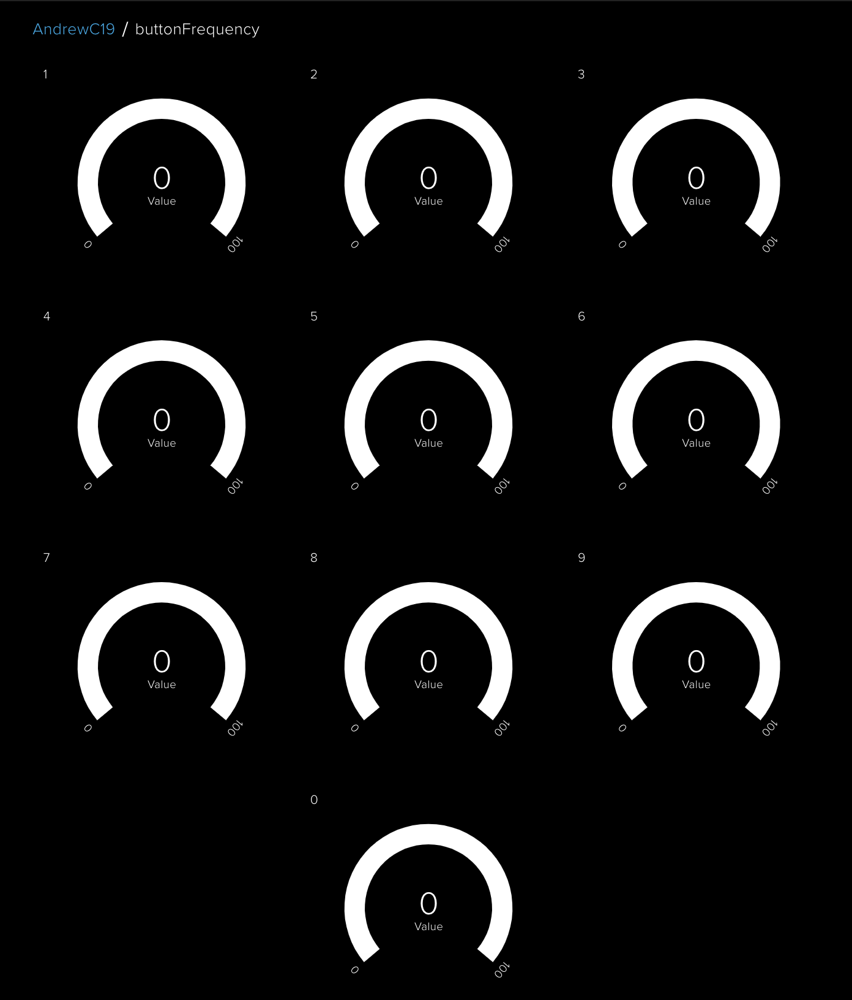
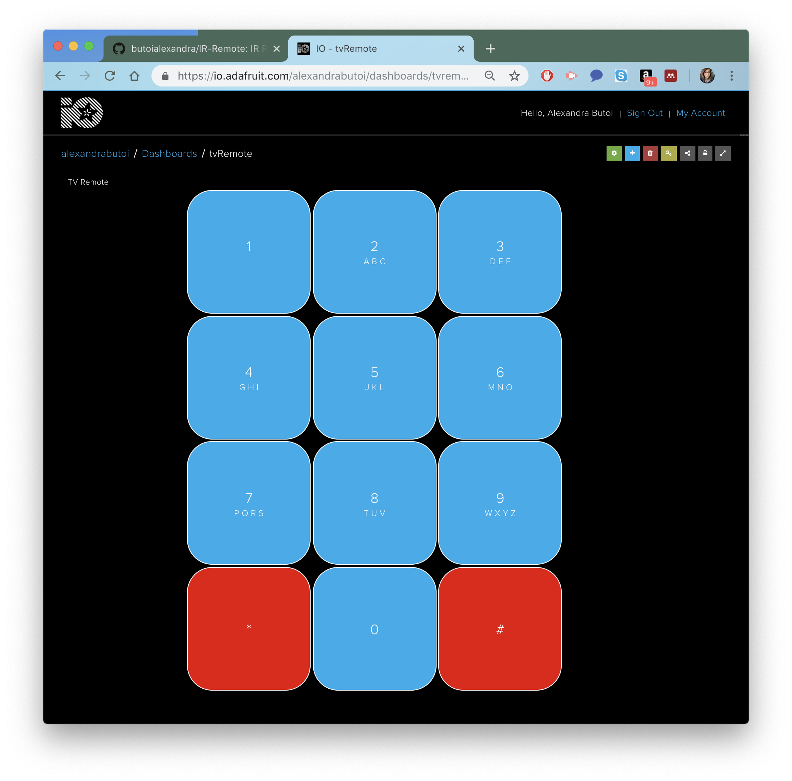

# IR-Remote
For this project, an IoT-styled TV Controller has been designed and implemented. The focus throughout development has been to create a useful, fun and internet connected device that stands out from your usual TV Remote to offer fun extra features that may even be useful. In particular, we aim to make use and demonstrate our knowledge of the IoT by producing a device that best utilises the hardware available, providing as much network connectivity as possible whilst maintaining security. The main motivation for selecting this project is that I have a TV without a working remote, and would like to be able to retune and use this TV again!

# Design Criteria
The TV remote design can be split into two distinct parts. Firstly, the remote itself should be fully functional and do everything you expect a regular remote to do. Secondly, it should be as IoT driven as possible - i.e. not just a TV remote, but a remote that clearly demonstrates IoT-styled functionality. In particular, we want the remote to be highly network connected. Ideally, the solution would allow for input via a platform such as Adafruit or IFTTT such that a user could control the device from a distance. As a result, the remote could be placed permanently facing the TV so that if left on, you could just log in to the platform and turn it off. Also, it would be nice to use a platform to record and analyse usage - for example, which channel do I visit most frequently? Such a design could be extended to provide more interesting and insightful analytics.

In terms of the code, an effective solution would clearly be object-oriented. A TV controller can easily be divided into a series of objects, behaviours and relationships; thus, making sense to structure the code in the same fashion. We aim to use good C++ practice, making use of header files etc. and object-oriented features to get as much power out of the solution as possible.

The main interaction with the device will be via touch screen, we will therefore design the solution around this and add the platform driven functionality later, which will emulate a touch screen interaction. The algorithm for handling a touch (and therefore any interaction with the device) is as follows:

```python
if screen touched:
	get touch coordinates;
	if touch coordinates inside a button:
		button = touched;
		while button touched:
			send buttons IR code to TV;
			change colour;
			increment button count on Adafruit;

```
The design criteria is summerised as follows:

<center>

|     Criteria         |     Reason                |
|:--------------------:|:-------------------------:|
| Object-oriented design | TV controller is a hierarchy of objects |
| Produce analytics | To give some useful usage stats, make device more fun |
| Allow for control from distance | Adds extra useful functionality and something different |
| Clear GUI | Make the device friendly and intuitive to use |
| Security | Need OTA updating incase of bugs/security flaws |

</center>

# Development Process
## Finding IR Codes
Since the controller for my Panasonic TV was broken, finding the IR codes for my TV was a difficult challenge. I began by searching the Arduino forums, and managed to find one hex code for the power button for my TV. Aside from this, I was able to find the hex codes for number buttons 0 - 9 on a Russian Arduino forum after a few hours of searching, luckily defined as P1 - P9, as I couldn't understand anything else. My aim was to replace my broken remote, so I needed to find the function buttons, however they were no where to be found. I did manage to find a load of Panasonic Pronto Codes, that look like this:

```
0000 0071 0000 0032 0080 003F 0010 0010 0010 0030 0010 0010 0010 0010 0010 0010 0010 0010 0010 0010 0010 0010 0010 0010
0010 0010 0010 0010 0010 0010 0010 0010 0010 0030 0010 0010 0010 0010 0010 0010 0010 0010 0010 0010 0010 0010 0010 0010
0010 0010 0010 0010 0010 0030 0010 0010 0010 0010 0010 0010 0010 0010 0010 0010 0010 0010 0010 0010 0010 0010 0010 0010
0010 0030 0010 0030 0010 0030 0010 0030 0010 0030 0010 0010 0010 0010 0010 0010 0010 0030 0010 0030 0010 0030 0010 0030
0010 0030 0010 0010 0010 0030 0010 0A98
```
I found a programme called IrScrutinizer (http://www.harctoolbox.org/IrScrutinizer.html), that allowed me to better understand this Pronto Code. I used the programme to 'Scruitinize' this code, which gave me three values; D, S and F. D corresponds to the device id, S the sub-device id and F the function id.

0x1004C4D is an example panasonic hex code. The D value always gives 10 and the sub device value (for my device) is always 0. Together this gives 0x100 (the 0x is always prefixed), however the last 4 digits are missing. The inverted F value gives the 4C, however, there is no documentation for how to get the last 2 digits, leaving us with 0x1004C. Fortunately, I managed to spot a pattern in the hex codes for my device. The last 2 digits are always a copy of the previous pair of digits, but where the second of the pair is incremented by 1 (either numerically or alphabetically). For example:

0x1004C --> 0x1004C4D

0x10052 --> 0x1005253

0x1002C --> 0x1002C2D

With this knowledge, I was able to get full functionality for my TV without using a remote. Just the list of Pronto Codes and IrScrutinizer.

## Sending IR Codes
With the IR codes, the next stage was to successfully send them to the TV and record the behaviour. To do this, we used IRSend from the IRremote library. IRSend contained a prewritten panasonic protocol, which requires the panasonic address (0x4004) and the hex code for the button pressed. We implemented a simple sketch that would read input from the Serial Monitor in the Arduino IDE and send a matching hex code (e.g. send hex code for 1 when 1 is input). This was generally successful, however, we found that we couldn't turn the TV on even though the TV was receiving the IR signal (as the LED on the TV would blink when IR blasted). After playing with some values, we realised that the TV would only turn on if the button was held, and therefore we repeated the IR blast 5 times over 250 ms to simulate this. Consequently, we could turn the TV on/off successfully.

## Building the GUI
As the Adafruit_GFX library provides many useful graphics functions for the remote's display, we used it to implement the GUI. Our object-oriented design allows to easily customise the GUI of the remote by adding/removing buttons, depending on the user's needs. We implemented a variety of button types (circle, square, triangle, etc.), which can be added to a user interface by simply specifying its coordinates, a label and a hex code to be sent to the TV. Our remote implements 2 screens (one for the numerical buttons and one for a variety of function buttons) and a user can switch between the two by pressing a button in the bottom right corner of the screen.

Below is a class diagram for our GUI.


## Sending analytics to Adafruit.io

After implementing the basic functionality of a normal TV remote (the ability to send IR codes to a TV and a GUI), we decided to give the users the ability to gain insights about the remote's usage (e.g. which buttons are used most frequently). Thus, we created a dashboard using Adafruit IO which displays how many times each button has been pressed. As Adafruit IO allows at most 10 free feeds at a time, we could implement this feature only for the 10 numerical buttons (digits 0-9). A screenshot of the dashboard is provided below.

## Getting input from Adafruit.io

Another useful feature of our remote is the ability to control the TV from the distance. In order to achieve this, we created a dashboard on Adafruit IO that allows the user to press any numerical button and the coresponding button on the remote will be pressed as well. 

## Over-the-air(OTA) Updates
In order to ensure that the firmware of the remote stays constantly up to date, we gave the users the possibility to update it over-the-air. This is a much more efficient and convenient way to both fix bugs and add new features than connecting the remote to a PC and manually updating the firmware. Every time the remote is rebooted, it checks for a new firmware available and it performs an update in case one is found. This could be improved by giving the users the ability to choose whether to update the firmware or not. However, as the OTA updates were not the main purpose of this project and we already implemented this feature for the previous project, we did not implement this again. As we understand the security risks involved, we chose to deliver the updates using a fairly secure protocol, HTTP. 

# Finished Product
## The TV Remote




## The analytics on Adafruit.io



## The virtual controller on Adafruit.io



# Testing
To ensure our solution is secure and robust, we manually tested as much functionality as possible. The only part missing is the OTA update, which we couldn't test since the server storing the bin files is no longer live. However, we still appreciate the importance of including OTA functionality, ensuring that an automatic update is possible. The tests are detailed below:

| Situation                   | Comment                                    							 |  Result  |
| --------------------------- |:--------------------------------------------------------------------:|:--------:|
| Pressing Number Button      | Sends corresponding number to TV            						 | Success  |
| Pressing Circle Button      | Sends corresponding function to TV         			  				 | Success  |
| Pressing Square Button      | Sends corresponding function to TV         							 | Success  |
| Pressing Change Page Button | Changes page on remote                 							     | Success  |
| Pressing Triangle Button    | Sends corresponding function to TV                                   | Success  |
| Pressing Power Button       | Initially wouldn't switch TV on, made the remote repeatedly send the signal for half a second to simulate holding; now turns TV on and off. | Success  |	
| Holding Number Button       | Sends corresponding number to TV as long as held                     | Success  |
| Holding Circle Button       | Sends corresponding function to TV as long as held                   | Success  |
| Holding Square Button       | Sends corresponding function to TV as long as held                   | Success  |
| Holding Change Page Button  | Continuously changes pages back and forth                            | Success  |
| Holding Triangle Button     | Sends corresponding function to TV as long as held                   | Success  |
| Pressing button whilst connected to Adafruit.io | Sends corresponding number or function to TV, but experiences latency due to internet connection. | Needs Improving |
| Controlling controller from Adafruit.io | Can successfully use the numerical buttons from Adafruit | Success  |
| Updating frequently used number on Adafruit.io | When a button is pressed, it will successfully update a counter on Adafruit.io | Success  |


# Conclusion
## Things to improve

There are several things that need further improvements. We could send to Adafruit analytics about the usage of each of the buttons of our remote, as well as let the user control all the buttons remotely (from the Adafruit dashboard), not only the numerical ones. As sending analytics to Adafruit reduces significantly the responsiveness of the remote, a user should be able to disable this function whenever they don't want to use it. This could be done by adding another button to the GUI that lets the user enable/disable this feature. In addition, we could improve the process of performing OTA updates by giving the user the possibility to choose when/whether to update or not and by using a more secure protocol like HTTPS. 

## What was done well
## How it is useful in IoT